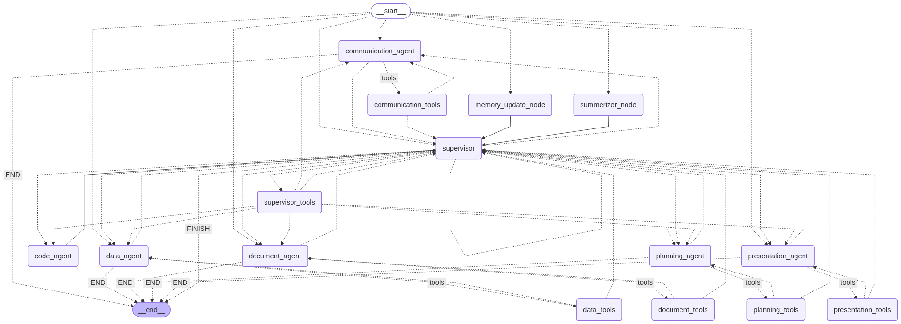

# 🤖 Advanced Agentic AI OS (Controls google workspace for you)

<!-- <p align="center">
    <picture>
        
    </picture>
</p> -->


<p align="center">
  <!-- <strong>AT YOUR SERVICE.</strong><br/> -->
  Multi-Agent • LangGraph • RAG + Knowledge Graph • Voice UI
</p>

<p align="center">
  <a href="https://python.org"></a>
  <a href="https://github.com/Yadeesht/Langgraph-Personal-Assistant-Agent"></a>
  <a href="https://github.com/Yadeesht/Agentic-AI-EXP/blob/main/SYSTEM.md"></a>
</p>

This is a personal agentic AI operating system built on a distributed agent architecture and orchestrated with **LangGraph**. It routes tasks across specialized agents, executes code in a sandbox, and supports both text + voice interactions through the web interface.

---

## ✨ Why this project

- **True multi-agent routing** with a central Supervisor and domain workers.
- **Google Workspace automation** across Gmail, Chat, Calendar, Drive, Docs, Sheets, Slides, Forms, and Tasks.
- **Long-term memory** via Episodic RAG + Knowledge Graph.

---

## 🧭 Table of contents

- [1) Prerequisites](#1-prerequisites)
- [2) Installation](#2-installation)
- [3) Environment and credentials setup](#3-environment-and-credentials-setup)
- [4) Run modes](#4-run-modes)
- [5) Web server dashboard controls](#5-web-server-dashboard-controls)
- [6) How to use (interactive examples)](#6-how-to-use-interactive-examples)
- [7) Architecture overview](#7-architecture-overview)
- [8) Project structure](#8-project-structure)
- [9) Troubleshooting](#9-troubleshooting)

---

## 1) Prerequisites

<details open>
<summary><strong>Required before first run</strong></summary>

- Python **3.11+** (project metadata allows 3.10+, but 3.11+ is recommended).
- A virtual environment (`.venv`) activated.
- API keys for at least one LLM provider (OpenRouter recommended).
- Google OAuth credentials file (`setup_cred.json`) for Workspace tools.
- Model folders present in `models/` (embedding models).

</details>

<details>
<summary><strong>Optional but recommended</strong></summary>

- `uv` for fast installation.

</details>

---

## 2) Installation

### Windows (PowerShell)

```powershell
git clone https://github.com/Yadeesht/Agentic-AI-EXP.git
cd Agentic-AI-EXP

python -m venv .venv
.\.venv\Scripts\Activate.ps1

pip install -r requirements.txt
```

### With `uv` (faster)

```powershell
uv pip install -r requirements.txt
```

---

## 3) Environment and credentials setup

### 3.1 Environment file

This repository currently includes `.env,example` (comma in the name). Copy it to `.env`:

```powershell
Copy-Item .env,example .env
```

Fill values in `.env` (minimum):

- `AZURE_AI_ENDPOINT`
- `AZURE_AI_CREDENTIAL`
- `AZURE_API_VERSION` (default: `2024-12-01-preview`)
- `MODEL_NAME` (your Azure deployment name)
- `GOOGLE_PSE_API_KEY` + `GOOGLE_PSE_ENGINE_ID` (if using Google search tools)
- `DEFAULT_THREAD_ID` (for terminal mode)
- `TRANSPORT_MODE=stdio`

### 3.2 Google OAuth files

Place your Google OAuth app credential JSON as:

- `app_tools/cred/setup_cred.json`

On first use, token files are created under:

- `app_tools/cred/gmail_token.json`
- `app_tools/cred/calendar_token.json`
- `app_tools/cred/gdocs_token.json`
- `app_tools/cred/gchat_token.json`
- `app_tools/cred/gtask_token.json`

> Keep credential and token files private. Never commit real secrets.

---

### 3.3 Local models structure

All models are bundled locally under `models/` — no internet connection required at runtime.

```
models/
├── bge-small/              # Embedding model — Knowledge Graph semantic search
│
├── gte-base/               # Embedding model — Episodic RAG vector storage
```

| Folder | Model | Used for |
|---|---|---|
| `bge-small` | BAAI/bge-small-en | Knowledge Graph entity search |
| `gte-base` | thenlper/gte-base | Episodic RAG chunk embedding |

> The listed model folders must be present before starting. They are included in this repository.

---

## 4) Run modes

### A) Custom web dashboard (recommended)

```powershell
python frontend/web_server.py
```

Open the URL shown in terminal (typically `http://127.0.0.1:8080`).

### B) Terminal mode (`main.py`)

```powershell
python main.py
```

Use `exit`, `quit`, or `bye` to stop.


---

## 5) Web server dashboard controls

From the dashboard page, you can chat with JARVIS, see real-time thought/action logs, configure environment variables, and toggle enabled tools.

---

## 6) How to use (interactive examples)

Use these prompts directly after startup:

### Communication
- “Send an email to `john.doe@example.com` with subject `Project Update` and summarize today’s outcomes.”

### Planning
- “Create a 1-hour meeting tomorrow at 2 PM called `Q1 Planning` and add Alice + Bob.”

### Content
- “Create a Google Doc named `Weekly Notes` and add bullet points for priorities, blockers, and actions.”

### Code automation
- “Read CSV files in my Drive folder `Sales Data`, compute monthly totals, and write results to a Sheet called `Monthly Sales Summary`.”

## 7) Architecture overview

<p align="center">
  
</p>

This ilt around a **stateful LangGraph** where every node is a purposeful participant — not just a tool-caller.

### Entry and routing

- **`__start__`** is the graph entry point. Each incoming message first passes through `route_start`, which decides whether to update memory, summarize the conversation, or proceed directly to the Supervisor.
- **`supervisor`** is the central decision node. It reads the conversation state and routes to the right domain agent.

### Domain agents

| Agent | Tools | Handles |
|---|---|---|
| `communication_agent` | `communication_tools` | Gmail, Google Chat |
| `planning_agent` | `planning_tools` | Calendar, Google Tasks |
| `code_agent` | Sacrificial sandbox | Python code generation + execution |
| `document_agent` | `document_tools` | Google Drive, Docs |
| `data_agent` | `data_tools` | Google Sheets, Forms |
| `presentation_agent` | `presentation_tools` | Google Slides |

Each agent runs autonomously in a loop: call tools → return to supervisor with a `FINAL ANSWER` or `TALK TO USER` signal → route to `__end__`.

### Memory and maintenance nodes

- **`summerizer_node`** — condenses long conversation histories before the token limit is hit; routes back to the supervisor seamlessly.
- **`memory_update_node`** — triggered at session boundaries or when context grows stale; writes to both the Episodic RAG and the Knowledge Graph, then returns to the supervisor.

### Flow summary

```
__start__
    │
    ├── [memory needed?]  → memory_update_node → supervisor
    ├── [too long?]       → summerizer_node    → supervisor
    └── [default]         ──────────────────── → supervisor
                                                       │
                                               supervisor
                                                   │
               ┌──────────────────┬────────────────┼─────────────┬─────────────┬─────────────┐
               ▼                  ▼                ▼             ▼             ▼             ▼
      communication_agent   planning_agent    code_agent  document_agent  data_agent  presentation_agent
               │                  │                │             │             │             │
      communication_tools   planning_tools     (sandbox)  document_tools  data_tools  presentation_tools
               │                  │                │             │             │             │
               └──────────────────┴────────────────┴─────────────┴─────────────┴─────────────┘
                                                   │
                                                __end__
```

For full routing logic and state schema, see [SYSTEM.md](./SYSTEM.md).

---

## 8) Project structure

Key runtime files:

- `main.py` — terminal interaction loop
- `frontend/web_server.py` — FastAPI dashboard web server and static assets
- `core/graph.py` — LangGraph orchestration
- `config/settings.py` — model/provider/runtime configuration
- `tools/*.py` — Tool registration entrypoints
- `rag/` — Episodic RAG + Knowledge Graph logic

---

## 9) Troubleshooting

<details>
<summary><strong>Web server starts but no responses</strong></summary>

- Verify `.env` keys are set correctly.
- Check that Azure endpoint, key, API version, and deployment name are valid.
- Confirm `TRANSPORT_MODE=stdio` and Python environment is active.

</details>

<details>
<summary><strong>Google tools fail with auth errors</strong></summary>

- Ensure `app_tools/cred/setup_cred.json` is valid OAuth client JSON.
- Delete expired token files in `app_tools/cred/` and re-authenticate.

</details>

## Docs

- System Deep Dive: [SYSTEM.md](./SYSTEM.md)

<p align="center">
  <i>"Sometimes you gotta run before you can walk."</i>
</p>
